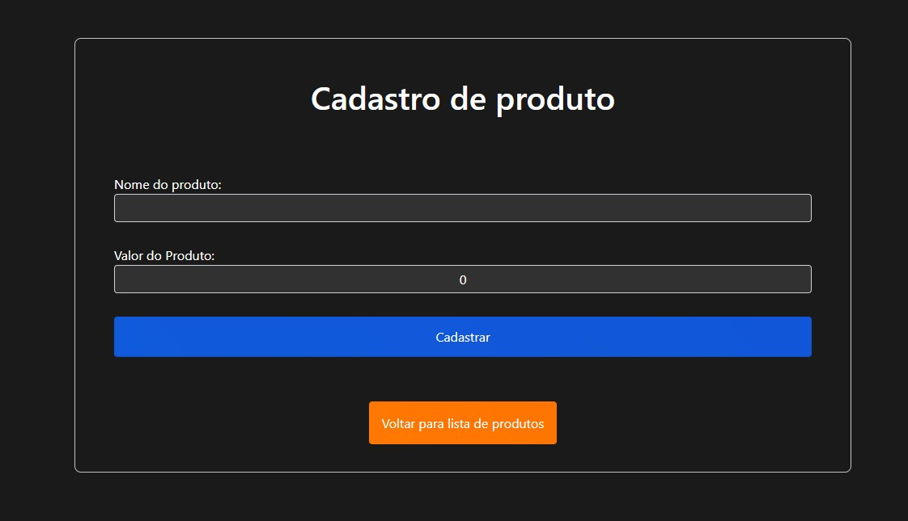

<h1 align="center"><b>LojaEstoque</b></h1>

Este projeto faz parte de um teste prático de uso das ferramentas .NET para criação de um sistema que implemente CRUD.
 

<a href="#sobre"><b>Sobre</b></a> •
<a href="#features"><b>Features</b></a> •
<a href="#tecnologias"><b>Tecnologias</b></a> •
<a href="#pre-requisitos"><b>Pré-Requisitos</b></a> •
<a href="#autor"><b>Autor</b></a> 

 

<h2 id="sobre"><b>Sobre</b></h2>

O objetivo do sistema é realizar visualização, cadastro, alteração e exclusão de produtos em um banco de dados.

O banco de dados funciona através de migrations que é implementada por ferramentas do Entity Framework.

Para administrar como serão salvos os dados e como serão geridos a aplicação conta com classes de repositório, sendo que cada classe é especifica para manutenção de sua tabela.
 

Os objetos que dão os atributos necessários para o funcionamento da aplicação encontram-se na classe modelo, fazendo parte da MODEL no MVC. 

<h2 id="features"><b>Features</b></h2>

<h3><b>Busca</b></h3>

A página contém um input de busca com autocomplete que oferece opções disponíveis de produtos.

 

Caso o produto não exista ou não seja encontrado será exibido um aviso através de um dialog.

 
<h2><b>Lista de produtos</b></h2>

Cada produto possuí ID, NOME e VALOR, e em cada um existe o botão de editar e excluír.

 
<h2><b>Editar</b></h2>

Ao clicar em editar a pagina encaminha os dados do produto para um formulário que virá previamente preenchido com dados atuais para que possam ser alterados.

 
<h2><b>Cadastrar</b></h2>

O formulário para cadastro é o mesmo utilizado na edição, porém o mesmo vem sem nenhum dado inserido, para que possa inserir nome e valor de um novo produto.

 
<h2><b>Avisos e Mensagens</b></h2>

Ao tentar excluír será exibido um diálogo para confirmação, após clicar no mesmo o produto será excluído do banco de dados.

O mesmo painel de diálogo é utilizado para exibir confirmações de todas as ações.

 
<h2><b>Seleção de temas</b></h2>

A página possuí tema light e dark, as configurações são salvas em local storage.

<h2 id="tecnologias"><b>Tecnologias</b></h2>

- **`ASP.NET Core`**
- **`CSharp`**
- **`.NET Framework`**
- **`Entity Core Framework`**
- **`SQL Server`**
- **`HTML 5`**
- **`CSS 3`**
- **`Javascript`**

A base tecnológica da aplicação é o NET Core, com o uso do MVC e pastas mapeadas para que a aplicação faça a integração entre Movel, View e Controller.

Para o uso do repositório foi utilizado o entity Framework, utilizando-se de migrations para que o banco de dados seja atualizado sem que dados sejam perdidos.

Com o objetivo de demonstrar o uso do NET Core poucas classes são criadas, apenas as necessárias para gerir as informações que serão armazenadas no banco de dados e o objeto que vai representar essas classes, sendo este a classe "produto".

Para responsividade e demais interações visuais foram utilizados técnicas de animação com CSS e Javascript integrados ao HTML.
 

<h2 id="pre-requisitos"><b>Pré-Requisitos</b></h2>

Para utilizar a aplicação é necessário possuir .NET 6 ou mais recente e  SQL Server

O arquivo "appsettings.json" deverá ser editado para que seja inserida uma conexão ao banco de dados

    "ConnectionStrings": {
      "DefaultConnection": "sua conexão";
    }

Alterar a <b>DefaultConnection</b> para:

    "Data Source=SEU BANCO DE DADOS; Database=LandingPageDB; Trusted_Connection=True; MultipleActiveResultSets=true; User ID=SEU USER; Password=SUA SENHA"

Após a conexão estar configurada basta apenas inicializar a aplicação.

 

<h2 id="autor"><b>Autor</b></h2>

| [ Felipe Rodrigues Santos](https://github.com/FelipeR-S) |  
| :---: |